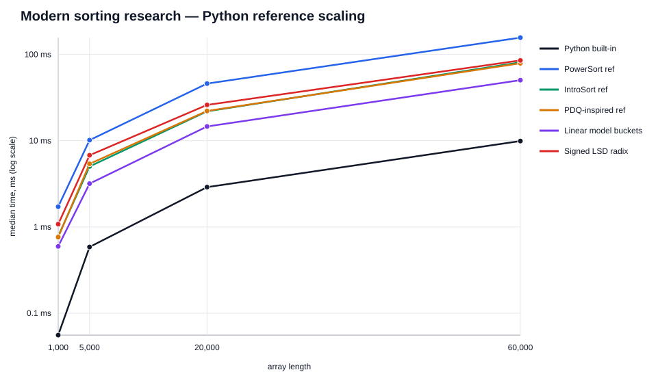
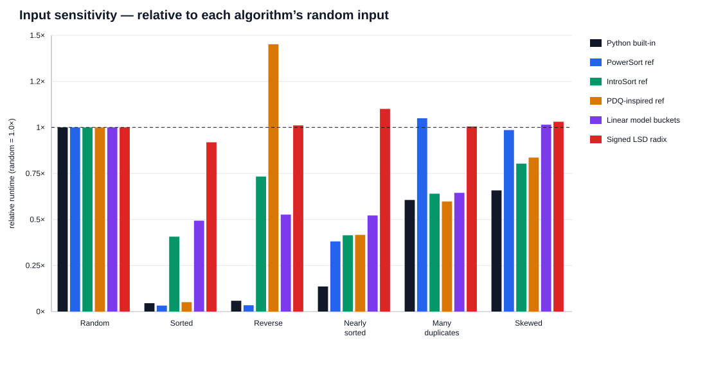

# Modern sorting research

This branch extends the original array-sorting collection with modern adaptive, parallel and distribution-aware algorithms. The goal is not to collect names, but to keep implementations testable, benchmarkable and explicit about their limitations.

Main project index: https://github.com/Mika-dot/Array-sorting/tree/main

## Implemented algorithms

| Algorithm | Stable | Time | Extra memory | Main idea / use case |
|---|:---:|---|---|---|
| `Intro` | No | `O(n log n)` worst-case | `O(log n)` stack | Quicksort speed with heapsort fallback and insertion sort for small partitions. |
| `PdqInspired` | No | `O(n)` on already ordered input; `O(n log n)` average/worst fallback | `O(log n)` stack | Pattern-aware introspective quicksort. This is deliberately named **PDQ-inspired**; it is not claimed to be a source-compatible port of reference pdqsort. |
| `Power` | Yes | `O(n)` for one natural run, `O(n log n)` worst-case | `O(n)` merge buffer | Natural-run mergesort using the Powersort node-power merge policy. |
| `Psrs` | No | local sorting `O(n log n)` plus sampling/merging | `O(n + p²)` in this implementation | Parallel Sorting by Regular Sampling: local sorts, regular samples, global pivots, parallel bucket merges. |
| `LinearModelBuckets` | No | distribution-sensitive; bounded by local `O(n log n)` IntroSort | `O(n + b)` | Learned-sort-inspired baseline: a linear CDF approximation predicts coarse buckets, then buckets are sorted exactly. |
| `SignedLsdRadix` | Yes | `4 × O(n + 256)` = `O(n)` for `Int32` | `O(n + 256)` | Four stable byte passes; signed order is mapped with `value ^ int.MinValue`. |

Source: [`sorting/sorting/ModernSorting.cs`](sorting/sorting/ModernSorting.cs)

## Benchmark results

Every benchmark uses deterministic input (`seed = 20260905`) and verifies the output against a reference sorted sequence. The plots below measure the Python reference implementations in [`tools/generate_modern_benchmarks.py`](tools/generate_modern_benchmarks.py). They demonstrate scaling and input sensitivity; they are **not** absolute C# performance numbers.



Source data: [`modern-scaling.csv`](docs/assets/modern/modern-scaling.csv)

The input-shape experiment normalizes each algorithm to its own random-array runtime (`1.0×`). It makes adaptivity visible: natural-run Powersort and the PDQ-inspired implementation benefit sharply from ordered inputs, while fixed-pass LSD radix is comparatively insensitive to input order.



Source data: [`modern-input-shapes.csv`](docs/assets/modern/modern-input-shapes.csv)

## Correctness and CI

The branch contains deterministic C# smoke tests covering empty/singleton arrays, duplicates, negative values, sorted and reverse inputs, and random arrays up to 10,000 elements:

```bash
dotnet run --project sorting/tests/SortingSmoke/SortingSmoke.csproj -c Release
```

The research branch targets `.NET 8`. GitHub Actions builds the library and runs both the C# smoke suite and the existing Python reference tests on every push to this branch.

To regenerate the modern reference charts:

```bash
python3 -m pip install -r tools/requirements.txt
python3 tools/generate_modern_benchmarks.py
```

## Research notes

### Powersort

Powersort is an adaptive merge policy introduced by J. Ian Munro and Sebastian Wild. It chooses merges by assigning a node power to adjacent runs rather than using a fixed merge schedule. CPython adopted Powersort for list sorting in Python 3.11. This branch implements the natural-run + node-power core as `ModernSorting.Power`.

References:
- https://arxiv.org/abs/1805.04154
- https://github.com/python/cpython/blob/main/Objects/listsort.txt

### Pattern-defeating quicksort

Pattern-defeating quicksort is a modern quicksort family designed to avoid common bad partition patterns while retaining strong practical performance. `PdqInspired` explores those engineering ideas with an explicit heapsort fallback, insertion-sort cutoff, bad-partition budget and ordered-partition fast path. It is intentionally not presented as an exact pdqsort port.

Reference: https://arxiv.org/abs/2106.05123

### PSRS and modern parallel sample sorting

PSRS is included as a clean CPU-parallel baseline. More aggressive descendants such as IPS4o combine sampling, in-place partitioning and cache-conscious parallelism. That is a useful future comparison once the repository has a BenchmarkDotNet harness for large arrays and multicore scaling.

Reference: https://arxiv.org/abs/1705.02257

### Learning-augmented sorting

Recent work treats learned sorting as a sample-sort-like pipeline where a model predicts approximate ranks or buckets and exact sorting finishes the job. `LinearModelBuckets` is deliberately a small transparent baseline: it lets the benchmark expose both the upside on suitable distributions and the downside when the model is a poor fit.

Reference: https://arxiv.org/abs/2307.08637

### Recent direction: Virtual-Memory Powersort (2026)

A 2026 ESA paper proposes Virtual-Memory Powersort, reducing Powersort's auxiliary buffer from roughly `n/2` elements to `O(sqrt(n log n))` while preserving near-optimal merge behavior up to additive linear overhead. It is not implemented here yet and is tracked as a research target rather than being falsely marked complete.

Reference: https://doi.org/10.4230/LIPIcs.ESA.2026.14

### Rust's newer sorting work

Rust replaced its standard-library sorting internals with newer implementations in the Rust 1.81 era; the stable path is built around `driftsort`, which combines merge-sort and quicksort ideas and uses a Powersort-style heuristic. A faithful port is substantially more involved than adding a textbook function, so it belongs in a dedicated future branch with implementation-level benchmarks.

References:
- https://blog.rust-lang.org/2024/09/05/Rust-1.81.0/
- https://doc.rust-lang.org/src/core/slice/sort/stable/drift.rs.html

## Known cleanup from the previous research branch

The previous `AdditionalSorting.Smooth()` method returned `Heap(array)` and therefore was **not Smoothsort**. That alias has been disabled instead of continuing to publish a mislabeled implementation. A real Leonardo-heap Smoothsort remains on the backlog.

`Cycle` was also hardened against duplicate-heavy inputs where advancing past equal values could run beyond the array boundary.

## Next experiments

- [ ] Implement and validate real Leonardo-heap Smoothsort.
- [ ] Implement Virtual-Memory Powersort from the 2026 ESA paper.
- [ ] Add an exact pdqsort/driftsort-inspired implementation suitable for apples-to-apples comparison.
- [ ] Add BenchmarkDotNet C# wall-clock, allocation, branch and multicore measurements.
- [ ] Compare PSRS against an IPS4o-style parallel sample-sort implementation.
- [ ] Expand learned sorting beyond the linear model to a piecewise monotone rank model while retaining exact fallback behavior.
